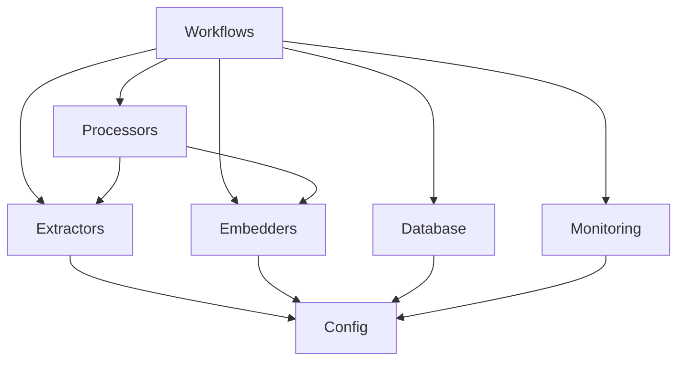

# Core Infrastructure

The `core/` directory contains the foundational infrastructure components of the HADES-Lab system, implementing the Conveyance Framework and Information Reconstructionism theory in production-ready, reusable modules.

## Overview

This infrastructure layer embodies the mathematical framework:
```
Information = WHERE × WHAT × CONVEYANCE × TIME
C = (W·R·H/T)·Ctx^α
```

Each subdirectory represents a critical dimension of the information processing pipeline.

## Directory Structure

```
core/
├── config/       # Configuration management system
├── database/     # Database abstraction layer (ArangoDB)
├── embedders/    # Vector embedding implementations
├── extractors/   # Content extraction from various formats
├── graph/        # Graph operations and structures
├── monitoring/   # Performance and progress tracking
├── processors/   # Document processing pipelines
└── workflows/    # Orchestration and state management
```

## Theoretical Foundations

### Conveyance Framework Implementation

- **WHERE (R)**: Relational positioning via graph structures and database topology
- **WHAT (W)**: Content quality through extractors and processors
- **WHO (H)**: Agent capabilities via embedders and model configurations
- **TIME (T)**: Efficiency tracking through monitoring and workflows
- **Context (Ctx)**: Amplified through configuration coherence (α ≈ 1.5-2.0)

### Actor-Network Theory

Each component acts as a node in the knowledge network, with well-defined interfaces serving as "obligatory passage points" for information translation.

## Component Dependencies



## Usage Patterns

### Basic Import Structure

```python
# Configuration management
from core.config import ConfigManager, BaseConfig

# Content extraction
from core.extractors import DoclingExtractor, LaTeXExtractor

# Vector embeddings
from core.embedders import JinaV4Embedder, EmbedderFactory

# Document processing
from core.processors import DocumentProcessor

# Database operations
from core.database import ArangoClient

# Workflow orchestration
from core.workflows import PDFWorkflow, WorkflowState

# Progress monitoring
from core.monitoring import ProgressTracker
```

### Example: Processing Pipeline

```python
# Configure components
config = ConfigManager.load_config("pipeline_config.yaml")

# Initialize extractor
extractor = DoclingExtractor(config.extraction)

# Extract content
content = extractor.extract(document_path)

# Generate embeddings
embedder = JinaV4Embedder(config.embedding)
vectors = embedder.embed(content.chunks)

# Store in database
db = ArangoClient(config.database)
db.store_embeddings(document_id, vectors)
```

## Design Principles

### 1. Zero-Propagation Gate
If any dimension (W, R, H) = 0 or T → ∞, then C = 0. Components validate inputs to prevent dimension collapse.

### 2. Context Amplification
Configuration coherence exponentially amplifies system effectiveness through the Ctx^α term.

### 3. Atomic Operations
All database operations are atomic - either complete success or full rollback.

### 4. Phase Separation
Extract → Process → Embed → Store phases are cleanly separated for optimal resource utilization.

### 5. Reusability
Core components are framework-agnostic and can be imported by any tool or experiment.

## Performance Characteristics

- **Extraction Rate**: ~36 documents/minute (32 workers)
- **Embedding Rate**: ~8 documents/minute (8 GPU workers)
- **Database Writes**: ~1000 chunks/second
- **Memory Efficiency**: FP16 support reduces GPU memory by 40%

## Environment Requirements

```bash
# Required environment variables
export ARANGO_PASSWORD="your-password"
export ARANGO_HOST="localhost"
export CUDA_VISIBLE_DEVICES="0,1"

# Optional performance tuning
export USE_GPU=true
export BATCH_SIZE=24
export NUM_WORKERS=32
```

## Testing

```bash
# Run unit tests
pytest core/tests/

# Integration tests
pytest core/tests/integration/

# Performance benchmarks
python core/tests/benchmarks/run_benchmarks.py
```

## Contributing

When adding new components:

1. Extend appropriate base classes (`*Base`)
2. Include theory connections in docstrings
3. Implement zero-propagation validation
4. Add comprehensive unit tests
5. Update factory patterns if applicable

## Related Documentation

- [Config System](./config/README.md) - Configuration management
- [Embedders](./embedders/README.md) - Vector embedding implementations
- [Extractors](./extractors/README.md) - Content extraction
- [Monitoring](./monitoring/README.md) - Progress tracking
- [Workflows](./workflows/README.md) - Pipeline orchestration